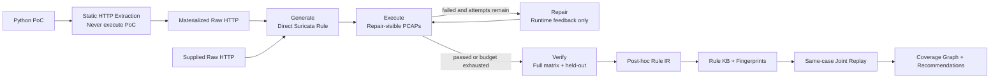

# SuricataAgent

SuricataAgent 把漏洞描述、PoC 和 HTTP 证据转换为经过真实 Suricata 回放验证的规则。
当前生产主链固定为 hidden benchmark 中表现最好的 **E Direct + Execution-guided Repair**：
模型直接使用完整 Suricata 表达能力生成规则，系统负责执行、反馈、最终验证和归档。



关键边界：

- Generate 和 Repair 输出完整 Suricata rule，不经过生成期 IR 或 compiler。
- 只有 Python PoC 时先通过 AST 静态提取请求；系统不会导入、执行或联网运行 PoC。
- Repair 只看到固定的 repair split；`verify_only` 样本只在最终 Verify 使用，结果不回流。
- Repair 候选必须保留首次生成规则的 action、protocol、header、direction、SID、rev、flow、
  method 及 endpoint/parameter 语义锚点；确定性 diff 拒绝越界修改。
- Repair 采用不回退验收：Suricata 语法必须通过，已通过样本不能回退，repair 集不能新增
  误报，并且候选必须带来可测改进；被拒绝的候选不会替换当前规则。
- 生成规则按不可信可执行检测产物处理；生产策略仅允许 HTTP 请求规则，强制
  `flow:established,to_server`，限制 PCRE/content/`byte_jump`，并拒绝 dataset、Lua、
  filestore 和跨规则状态关键字。
- Verify 是唯一交付门槛：syntax、全部正向样本和全部负向样本必须通过。
- Rule IR 在 Verify 后解析，仅用于解释、指纹、搜索和规则治理，不影响生成结论。
- 只有 verified 且可解析的 final rule 才进入 Rule KB。
- Coverage Graph 只比较同一 case、同一完整 PCAP 矩阵上的联合回放结果；指纹相似本身
  不能产生删除或支配建议。

生产入口：

```powershell
python main.py case.json --output-dir artifacts --max-attempts 3
python web_app.py
python benchmark_runner.py --mode full --output-dir benchmark-artifacts
```

CLI、Web API 和 Benchmark 都只从 `production.py` 导入生产契约，运行
`E-direct-repair-v1`，并在报告中写入 `pipeline_id`。旧 `main.build_workflow` 保留用于 B/C
冻结消融复现，不再是默认产品路径。

## 现有结构化工作流（Legacy B/C）

下面的 Detection Plan/Compiler 链路继续保留，用于冻结消融复现；Benchmark v0 已证明
它不应继续作为新规则生成主线。

```text
运行环境预检
  -> 构造正向变体 / 近似负样本矩阵
  -> LLM 提取 1～3 个真正不同的 Detection Strategy JSON
  -> 代码物化可选 semantic testcase 为真实 HTTP / PCAP
  -> Python 严格解析、lint 并确定性编译
  -> Suricata 语法检查和逐样本 PCAP 回放
  -> syntax / lint / positive / negative 确定性门禁
  -> 多个主候选通过时交给 LLM Final Judge
       | case_specific 通过 -> 固定主规则 SID -> 保存产物
       | success_indicator 通过 -> 分配补充 SID -> 单独保存
       | 失败 -> 确定性诊断 -> 携具体失败样本重试
```

`precision`、`robust`、`alternative_evidence` 是可选策略提示，不是固定流水线位置。
证据只支持一种可靠策略时可以只输出一个；没有强响应证据时不应强造 Alternative。

```json
{
  "candidates": [
    {
      "role": "precision",
      "direction": "request",
      "detection_scope": "case_specific",
      "protocol": "http",
      "method": "GET",
      "features": [
        {
          "buffer": "http.uri.raw",
          "content": "/evo-apigw/evo-cirs/material/viewPDF"
        },
        {
          "buffer": "http.uri.raw",
          "content": "pdfUrl=file:///etc/passwd",
          "nocase": true
        }
      ],
      "dynamic_fields": ["Host", "Content-Length"],
      "reason": "接口、参数和完整利用值共同限定当前漏洞"
    },
    {
      "role": "robust",
      "direction": "request",
      "detection_scope": "case_specific",
      "protocol": "http",
      "method": null,
      "features": [
        {
          "buffer": "http.uri.raw",
          "content": "/evo-apigw/evo-cirs/material/viewPDF"
        },
        {"buffer": "http.uri.raw", "content": "file", "nocase": true},
        {
          "buffer": "http.uri.raw",
          "pcre": "/(?:file:|file%3a)(?:\\/|%2f){2,3}etc(?:\\/|%2f)passwd/i"
        }
      ],
      "dynamic_fields": ["Host", "Content-Length"],
      "reason": "保留最小接口身份，减少参数名和分隔符表示绑定"
    },
    {
      "role": "alternative_evidence",
      "direction": "response",
      "detection_scope": "success_indicator",
      "protocol": "http",
      "method": null,
      "features": [
        {"buffer": "file_data", "content": "root:x:0:0:root:"},
        {"buffer": "file_data", "content": ":/root:/bin/"}
      ],
      "dynamic_fields": ["Content-Length"],
      "reason": "使用文件读取成功后的独立响应证据，仅作为补充指标"
    }
  ],
  "semantic_testcases": [
    {
      "expected": "alert",
      "changes": [{"location": "query", "field": "pdfUrl", "value": "file:///etc/shadow"}],
      "reason": "同一读取语义的另一敏感目标"
    },
    {
      "expected": "no_alert",
      "changes": [{"location": "query", "field": "pdfUrl", "value": "https://example.com/a.pdf"}],
      "reason": "相同字段的正常 PDF 值"
    }
  ]
}
```

模型不能输出 `action`、`msg`、`flow`、`classtype`、`sid`、`rev` 或完整规则。
编译器统一完成以下工作：

- 根据 request/response 分配 `to_server` 或 `to_client`。
- 分配 `msg`、`classtype`、`sid` 和 `rev`。
- 写入 `metadata:detection_scope <scope>`，使后续 IR、验证和覆盖分析使用同一语义。
- 为引号、反斜杠、分号、竖线和不可打印字节生成安全的十六进制 `content`。
- 检查 HTTP sticky buffer、方向和 PCRE 前置锚点。
- 强制 1～3 个候选角色唯一，并拒绝仅靠 `nocase`、method、reason 或
  `dynamic_fields` 制造的重复证据集合；Precision 和 Robust 都必须保留 endpoint 身份与
  exploit 语义，Robust 只能减少参数名和具体 payload 绑定，不能退化成跨接口 IOC。
- 固定 scope 契约：Precision、Robust 和 request Alternative 为 `case_specific`；response
  Alternative 为 `success_indicator`，模型不能自行改变层级以影响选择优先级。
- 拒绝只含 URI 路径和参数名、固定 Host/Content-Length/Cookie、过短 content、
  request/response buffer 混用等高误报候选。

因此，模型质量影响“选择哪些检测特征”，不会再影响规则分号、转义、SID 或 sticky
buffer 的基本语法。候选角色、范围、buffer 方向、动态字段和 exploit marker 统一定义在
`rule_knowledge.py`，Prompt、编译器、诊断器和样本派生器不再各自维护副本。

## 样本矩阵

每个样本都使用独立 TCP 流生成单独 PCAP。基础正向集包括原始攻击、Host 变化、
Header 顺序变化和 TCP 分段；当请求结构适用时，还会派生额外参数、参数顺序、URL
编码、路径大小写和等价斜杠等攻击变体。

请求正文会按 `Content-Type` 解析后再变异：

- `application/json`：字段顺序、Unicode 引用、无关字段、受控大小写和命令尾空白。
- `application/x-www-form-urlencoded`：参数顺序、等价 URL 编码和无关参数。
- `multipart/form-data`：boundary、唯一字段顺序、无关 part 和目标字段表示变化。
- `application/xml`、`text/xml` 与 `+xml`：属性顺序、字符引用和无语义 XML 注释。
- 其他文本正文：仅在共享 exploit marker 明确命中时生成保守的换行变体。

安全改写正文时会重新计算 `Content-Length`。如果响应能够被保守识别为 `/etc/passwd`
泄漏证据，还会派生 root-only、登录 shell 变化、账户行重排、增加无关账户和 TCP 分段等
正向响应变体，以及错误页、单片段诱饵和文档示例等近似负响应。当前自动响应语义识别只
覆盖能够可靠确认的 passwd 场景；其他响应会记录结构化 skip reason，不会猜测性改写。

近似负样本尽量靠近原始漏洞流量，包括：

- 相同接口和参数名，但值为空、普通文件名或合法相对路径。
- 不同接口携带相同攻击字符串。
- 不同接口携带相同攻击请求证据并保留原始攻击响应，用于验证事务身份约束。
- 相同接口中使用正常参数值，仅在 User-Agent 放入攻击字符串。
- 相同 body 字段置空或替换为普通值；攻击值只出现在 description、无关 part 或 XML
  注释中。
- 用户通过 CLI 或 Web 额外提供的负样本 PCAP。

每个 `TrafficSample` 通过 `validates` 声明它实际能够证明的目标：

| `validates` | 验证目标 | 适用规则 |
| --- | --- | --- |
| `generic` | 原始事务或用户提供的通用样本 | 当前规则集中的全部 SID |
| `request_detection` | 请求变体与请求侧近似负样本 | `direction=request` |
| `response_detection` | 成功响应变体与响应侧诱饵 | `direction=response` |
| `transaction_specificity` | 相同证据换到其他 endpoint 后不得冒充当前漏洞 | `detection_scope=case_specific` |

因此，请求侧负样本可以使用普通响应；事务特异性负样本则会保留原始攻击响应。验证器会
按方向和 scope 计算每个样本的 `expected_any_sids`。样本对当前候选不适用时仍保留回放
事实，但标记 `applicable=false`，不计入该候选的通过门槛、recall 或 FP。响应候选还必须
同时具备并通过 `response_detection` 的
正向变体和近似负变体；只有原始响应命中时会返回 `RESPONSE_ORACLE_REQUIRED`，不会被
当成已验证的补充规则。

并非每种漏洞都会生成所有变体；派生器只生成能够从当前 HTTP 请求确定得到的等价
样本。遇到 chunked、压缩正文、重复 Content-Type/Content-Length、未知字符集、
XML DTD/ENTITY 或无法安全解析的结构化正文时会跳过自动改写。跳过原因不会静默丢失，
而是以稳定的 `code`、`content_type`、`detail` 写入 `traffic-mutations.json` 和最终报告。
验证报告在 `sample_results` 中保留每个 PCAP 的预期、实际命中 SID 和通过状态，不再把
所有负样本结果合并成一个不可定位的列表。

模型还可以声明少量 `semantic_testcases`。它不能提交原始 HTTP 或 PCAP，只能替换原始
query、JSON 或 form 中已存在的字段；代码负责解析、编码、同步 Content-Length 和生成
PCAP。字段不存在、重复、格式不支持或协议边界不安全时会记录结构化拒绝原因。

## Rule IR 与规则库 Coverage Graph

`rule_ir.py` 把生成规则或历史 `.rules` 解析为统一中间表示，保留 SID、方向、scope、method、
sticky buffer、content/PCRE、nocase、否定匹配、管理字段，以及 endpoint/parameter/exploit/
success 证据分类；响应证据属于 success，不再被笼统归入 exploit。旧式 `http_uri` content
modifier 和 PCRE `U/I/P/H` 等 HTTP buffer modifier 也会映射到现代 sticky buffer。
`evidence_fingerprint.py` 对 raw/normalized buffer、大小写、
URI 编码、斜杠表示和等价字面量 PCRE 做稳定归一化，并同时提供可展示 JSON 和
`efp:v1:<sha256>` ID。Coverage Graph 另用包含 method、protocol、nocase、否定极性和
PCRE modifier 的 `lfp:v1:<sha256>`，不会把证据相似误报成检测逻辑相同。

Coverage Graph 不参与单个 CVE 的在线候选选择，只用于历史规则库治理。它直接使用规则库
批量回放产生的 `sample_results[].matched_sids`：

- `text_duplicate`：排除 SID/msg/rev 等管理字段后，检测文本相同。
- `logic_duplicate`：完整规则逻辑指纹与 TP/FP 覆盖相同。
- `coverage_duplicate`：检测逻辑不同，但当前 benchmark 覆盖相同。
- `dominates`：A 的正样本覆盖是 B 的超集，负样本误报是子集；覆盖相同时再比较复杂度。

推荐集合按“最大化攻击覆盖、最小化 FP、最小化规则数、最小化 PCRE/复杂度”的顺序
优化。候选不超过 16 条时使用精确搜索，更大规则库使用确定性 greedy + 冗余剔除。
这个结论只对输入样本矩阵负责，不会把未测试到的真实流量说成已证明。Coverage 输入
必须证明当前全部 SID 都参与了回放；空结果、错配 SID 或无法证明完整性的旧报告会被
拒绝，不能静默生成空的 `recommended.rules`。

生产链中的 `ruleops.py` 在此基础上提供持久化 Rule KB：verified final rule 写入时计算
文本 SHA-256、Evidence Fingerprint 和 Logic Fingerprint；文本或逻辑重复只增加
observation，不重复创建规则。存储层会拒绝未通过最终 Verify 的输入；跨 CVE 去重记录用
`case_ids` 保留全部 case membership，因此每个 case 仍可独立构建 Coverage Graph。每次
写入后，系统会取同一 `case_id` 的 active rules，重映射到互不冲突的 evaluation SID，
在当前完整矩阵上联合回放，再保存 Coverage Graph。Web API：

```text
GET /api/ruleops?q=<CVE-or-evidence>
GET /api/ruleops/rules/<record-id>
```

分析已有规则库：

```powershell
python rule_library.py .\rules\history.rules `
  --sample-results .\validation-report.json `
  --output-dir .\rule-library-analysis
```

会输出 `rule-ir.json`、`coverage-graph.json`、`library-summary.json` 和
`recommended.rules`。不提供 `--sample-results` 时只生成 IR，并明确拒绝给出删除建议。
`--sample-results` 必须来自同一批 `.rules` 的批量回放，不能拿单条生成规则的报告替代。
也可以让工具直接回放工作流已经生成的 PCAP 矩阵：

```powershell
python rule_library.py .\rules\history.rules `
  --traffic-matrix .\artifacts\traffic-matrix.json `
  --output-dir .\rule-library-analysis
```

此时会额外保存 `library-validation.json`；默认从 traffic matrix 同级的 `samples/`
寻找 PCAP，也可用 `--sample-root` 覆盖。

有 Coverage Graph 后，工具会同时生成不依赖模型的 `strategy-clusters.json`。需要最后
再让模型命名和归纳时显式增加 `--summarize-strategies`，产物改为
`detection-strategies.json`：

```powershell
python rule_library.py .\rules\history.rules `
  --sample-results .\validation-report.json `
  --summarize-strategies `
  --output-dir .\rule-library-analysis
```

模型只能填写固定的 `family`、`core_strategy`、`representation_variants` 和
`do_not_bind`；规则、SID、覆盖关系与推荐集合均不在模型输出 schema 中。没有推荐规则
的淘汰簇不会进入 catalog，组合证据中的历史 endpoint 和参数绑定也会在建簇、检索和
生成 Prompt 三层剥离。

## Legacy 候选选择与重试

每个候选会分别得到规则、Rule IR、样本结果和复杂度。为减少重复启动 Suricata，
实现可以批量回放后按 SID 拆分结果；某条规则造成批量语法失败时会单独加载，以隔离
坏候选。系统保存以下旧启发式值作为展示和排序参考：

```text
score = 正向覆盖率 × 100
        - 误报负样本数 × 50
        - PCRE 数量 × 5
```

它明确标记为 `decision_authority=reference_only`，不能证明“分高就是最佳”。
`dynamic_fields` 只记录不稳定字段，不参与最终规则或参考值。

syntax、lint、positive mutation 或 known negative 任一失败都会被系统淘汰。只有一个
`case_specific` 候选通过时直接交付；多个通过时，Final Judge 同时读取原始漏洞证据、
Rule IR、matrix 和复杂度，选择更像真实可部署逻辑的候选并说明过拟合风险。Judge 只能
选择通过集合中的 index；输出越权或不可解析时，系统按覆盖事实、误报数和最低复杂度降级。

候选评测时临时使用 `sid_start + candidate_index - 1` 区分告警。选出最终候选后会
重新编译，并把最终规则和验证结果统一映射回 `sid_start`。因此候选顺序不会改变交付
规则的正式 SID。

验证失败后，确定性诊断模块会分析规则、候选计划和逐样本结果，区分 PCRE 解析、
转义、方向、sticky buffer、raw/normalized URI、过度具体、缺少利用值和误报弱特征等
问题。下一轮 LLM 收到的是诊断、失败样本请求摘录和候选参考指标，仍然只能修复结构化
特征 JSON。默认最多尝试 3 次，环境错误和不可重试错误不会无意义地请求模型。

## Benchmark v0 消融结果

冻结开发集包含 12 个 CVE、60 个 PCAP。每个案例有 1 个原始攻击、2 个等价攻击变体和
2 个近似负样本；A/B/C 使用同一个 `gpt-5.5` 模型和同一份模型可见输入。原始 A/B/C
结果、逐案例记录和 12 条 Direct 规则已冻结在
[`benchmarks/baselines/v0`](benchmarks/baselines/v0/)，哈希清单可防止后续实验覆盖基线。

| 组别 | Syntax | Original | Variant | FP | Verified | Held-out variant |
|---|---:|---:|---:|---:|---:|---:|
| A Direct LLM | 83.3% | 75.0% | 54.2% | 5.0% | 33.3% (4/12) | 58.3% |
| B IR + Compiler | 33.3% | 33.3% | 4.2% | 0%* | 0% (0/12) | 0% |
| C Full Agent | 50.0% | 50.0% | 12.5% | 0%* | 0% (0/12) | 16.7% |
| D Direct + Validator | 83.3% | 75.0% | 54.2% | 5.0% | 33.3% (4/12) | 58.3% |
| E Direct + Validator + Repair | **91.7%** | **83.3%** | **70.8%** | 9.1% | **41.7% (5/12)** | 58.3% |

`*` B/C 有大量规则未生成或未通过语法，负样本未完整评测，不能把 0% 理解为零误报能力。
D 与 A 数值相同是预期结果：A 的评分阶段本来就包含 syntax 和 PCAP matrix，D 只是把这
一步显式物化，没有把结果反馈给模型。

E 与 A 配对复用完全相同的初始规则。repair 只能看到 `original`、`positive-01` 和
`negative-01`，`positive-02` 与 `negative-02` 始终 held out，最多直接修复 Suricata
rule 两次，不经过 Detection Plan 或 compiler。E 把可见 `positive-01` 命中从 6/12
提高到 10/12，但 held-out `positive-02` 保持 7/12；held-out 误报还从 1/10 增至 2/11。
因此 execution-guided repair 已产生增益，但当前增益主要来自修复已见测试，尚未证明
语义泛化。完整 A-E 快照与 E 的最终规则位于
[`benchmarks/experiments/direct-repair-v1`](benchmarks/experiments/direct-repair-v1/)。

Direct Rule 到生成期 IR 的表达能力审计进一步定位了瓶颈：后置 Rule IR 能解析 11/12，
当前 Detection Plan schema 只接受 7/12，compiler 只接受 6/12，检测语义可无损表达仅
3/12。主要损失包括 `startswith`、`distance/within`、无同 buffer content 前缀的
PCRE、Cookie 检测和强制 endpoint/exploit heuristic。明细见
[`ir-expressiveness-v0.md`](benchmarks/ir-expressiveness-v0.md)。这支持把 IR 从生成语言
调整为规则生成后的分析、指纹、覆盖图和知识治理语言。

在同一 12-CVE dev set 上继续运行 F/G：F 先提取不含 Suricata 字段的
`DetectionIntent`，再直接生成完整规则；G 严格复用 F 的初始 intent/rule，只把
`original`、`positive-01`、`negative-01` 的反馈交给模型，并在每次最小修复前先生成
`RepairDiagnosis`。`positive-02` 和 `negative-02` 始终 held out。

| 组别 | Syntax | Variant | Held-out variant | FP | Held-out FP | Verified |
|---|---:|---:|---:|---:|---:|---:|
| A Direct LLM | 83.3% | 54.2% | 58.3% | 5.0% | 10.0% | 33.3% (4/12) |
| E Direct + Repair | 91.7% | 70.8% | 58.3% | 9.1% | 18.2% | 41.7% (5/12) |
| F Semantic Intent + Direct | 50.0% | 25.0% | 25.0% | 8.3%* | 16.7%* | 16.7% (2/12) |
| G Semantic Intent + Diagnosis + Repair | **91.7%** | **79.2%** | **75.0%** | 9.1% | 18.2% | **66.7% (8/12)** |

`*` F 只有 6/12 条规则通过语法，FP 分母不完整，不能与完整评测系统直接比较。F 单独
表现差，说明 semantic intent 不是一个可靠的零修复生成器；G 在 dev set 上曾把
held-out variant recall 从 58.3% 提高到 75.0%，并把 Verified 从 5/12 提高到 8/12。
该开发集快照位于
[`benchmarks/experiments/semantic-intent-repair-v1`](benchmarks/experiments/semantic-intent-repair-v1/)。

随后在打开结果前预注册并封存了独立的 30-CVE / 150-PCAP hidden test。主实验只运行
A、E、G；F 仅作为 G 的配对 source。最终结果否定了 dev 上的 G 主线结论：

| 组别 | Syntax | Original | Held-out variant | Held-out FP | Verified | Avg latency |
|---|---:|---:|---:|---:|---:|---:|
| A Direct LLM | 90.0% | 73.3% | 50.0% (15/30) | 0% | 36.7% (11/30) | 34.9s |
| E Direct + Repair | **100%** | **100%** | **73.3% (22/30)** | 6.7% (2/30) | **66.7% (20/30)** | 62.2s |
| G Semantic Intent + Repair | 86.7% | 66.7% | 53.3% (16/30) | 0% | 53.3% (16/30) | 112.1s |

预注册的 G 架构确认门槛要求 held-out recall 相比 A 至少 `+10pp` 且 FP 增长不超过
`+5pp`；G 实际为 `+3.3pp / +0pp`，未通过。E 相比 A 的 held-out recall 提高
`23.3pp`、Verified 提高 `30pp`，但 held-out FP 增加 `6.7pp`。因此生产主链固定为 E，
下一阶段重点是 specificity-preserving repair，而不是继续在 hidden cases 上调整 G。

数据集、运行清单、120 个原始结果和 SHA-256 freeze manifest 位于
[`benchmarks/experiments/hidden-test-v1-primary`](benchmarks/experiments/hidden-test-v1-primary/)。
协议见 [`benchmarks/HIDDEN_TEST_PROTOCOL.md`](benchmarks/HIDDEN_TEST_PROTOCOL.md)，预注册
判定见 [`benchmarks/HIDDEN_TEST_PREREGISTRATION.md`](benchmarks/HIDDEN_TEST_PREREGISTRATION.md)。

验证冻结产物：

```powershell
python -B benchmarks/freeze_v0_baseline.py --verify
python -B benchmarks/freeze_direct_repair_experiment.py --verify
python -B benchmarks/freeze_semantic_intent_experiment.py --verify
python -B benchmarks/freeze_hidden_test_results.py --verify
python -B benchmarks/audit_ir_expressiveness.py
```

## 环境

```powershell
python -m pip install -r requirements.txt
$env:LLM_PROVIDER = "openai_compatible"
$env:LLM_API_KEY = "你的密钥"
$env:LLM_BASE_URL = "https://api.example.com/v1"
$env:LLM_MODEL = "模型名称"
```

也可以在项目目录创建 `.env`。它会在启动时读取，但不会覆盖进程中已经设置的环境
变量：

```dotenv
LLM_PROVIDER=openai_compatible
LLM_API_KEY=你的密钥
LLM_BASE_URL=https://api.example.com/v1
LLM_MODEL=模型名称
LLM_TEMPERATURE=0.1
# 可选：完全禁止外部模型请求
LLM_OFFLINE=0
# 可选：CLI 的持久化 Rule KB；Web 默认使用 artifacts/rule-kb.json
RULEOPS_STORE=C:\path\to\rule-kb.json
```

旧 `DEEPSEEK_API_KEY`、`DEEPSEEK_BASE_URL`、`DEEPSEEK_MODEL` 暂时作为迁移别名保留，
新部署应使用 `LLM_*`。代码不再提供默认远程地址或默认模型名。

项目优先发现 `suricata/suricata.exe` 和 `suricata/suricata.yaml`。使用其他安装位置时
设置：

```powershell
$env:SURICATA_BIN = "C:\path\to\suricata.exe"
$env:SURICATA_CONFIG = "C:\path\to\suricata.yaml"
```

Windows 现在由 Python `subprocess.run()` 直接启动 Suricata，执行语法检查和 PCAP
回放；程序会设置配置目录作为工作目录、补充便携版和 Npcap DLL 的 `PATH`，并串行化
本机 Suricata 进程。无需 bridge 脚本或额外的常驻 PowerShell 进程。

如果怀疑 IDE、自动化工具或进程沙箱改变了 Windows 子进程行为，请在普通 PowerShell
窗口中直接运行：

```powershell
& .\diagnose_suricata_launch.ps1 -Runs 5 -TimeoutSeconds 10
```

脚本分别测试 PowerShell 直启和与 Web 后端一致的 Python 子进程启动，完整日志写入
`.runtime/launch-diagnostics/<时间>/summary.json`：

- `NATIVE_OK`：两种方式均稳定，本机不需要 bridge。
- `PYTHON_CHILD_UNSTABLE`：PowerShell 稳定、Python 不稳定，才需要 sibling bridge。
- `SURICATA_RUNTIME_UNSTABLE`：PowerShell 基线也失败，应先检查 Suricata、Npcap、配置
  和终端安全软件。

## CLI 输入

创建 `case.json`：

```json
{
  "case_id": "demo-001",
  "base": "漏洞名称、版本和影响范围",
  "poc": "漏洞利用步骤及关键参数",
  "http_request_path": "request.raw",
  "http_response_path": "response.raw",
  "negative_pcap_paths": ["benign-near-miss.pcap"]
}
```

推荐通过 `http_request_path` 和 `http_response_path` 按 bytes 读取，避免改变畸形报文、
重复头、分块编码或二进制正文。也可以直接提供 `http_request` 和 `http_response`
字符串。相对路径以 `case.json` 所在目录为基准。

只有 Python PoC、没有 Raw HTTP 时，可以改为：

```json
{
  "case_id": "CVE-example",
  "base": "漏洞名称、版本和影响范围",
  "python_poc_path": "exploit.py"
}
```

系统会静态解析 `requests`、`httpx`、`urllib`、Pocsuite3 常见 HTTP 调用和 raw socket
请求，生成 `poc-extraction.json` 与 `selected-request.raw` 后进入同一 E 主链。提取
置信度不足时会返回 `POC_HTTP_LOW_CONFIDENCE`，不会执行 PoC 或伪造验证结果。

运行：

```powershell
python main.py case.json --output-dir artifacts --sid-start 6000000 --max-attempts 3
```

还可使用 `--suricata-bin` 和 `--suricata-config` 覆盖运行环境。CLI 最后输出 JSON
摘要；工作流通过时退出码为 `0`，失败时为 `1`。

## Web 启动

```powershell
python web_app.py
```

默认访问 `http://127.0.0.1:8000`。需要修改监听地址或端口时设置 `WEB_HOST` 和
`WEB_PORT`。Web 支持文本或 Base64 原始 HTTP 输入、最多 4 个用户负样本、后台任务、
repair/verify split、逐样本矩阵、规则 diff、可追溯结果解释、post-hoc IR，以及 PCAP、
规则、PCAP TCP 分析、Coverage Graph 和报告下载。样本矩阵会显示每个 PCAP 的 TCP
连接数及握手、FIN、RST 摘要。RuleOps 工作区提供 KB 搜索、文本/逻辑去重记录、
证据指纹分组和 same-case joint replay Coverage Graph。

Web 默认只监听本机。PoC 和 HTTP 证据会发送到 `LLM_BASE_URL` 指向的模型服务，
不要提交不应离开本机的凭据或敏感流量。

## 产物

输出目录的主要结构如下：

```text
artifacts/
├── rule-kb.json                   # 跨运行持久化 verified Rule KB
└── <run-id>/
    ├── traffic.pcap               # 原始正向样本的兼容入口
    ├── samples/                   # 每个正向变体和近似负样本的独立 PCAP
    ├── traffic-matrix.json        # 样本标签、原因与 repair/verify split
    ├── pcap-analysis.json         # 每个 PCAP 的 TCP 连接、握手与关闭统计
    ├── traffic-mutations.json     # 未执行 mutation 的结构化原因
    ├── generated.rules            # 通过最终 Verify 的规则
    ├── failed-candidate.rules     # 未达到交付门槛的最后规则
    ├── generated.rule-ir.json     # Final Rule 的后置 IR
    ├── generated.rule-ir-error.json
    ├── coverage-graph.json        # 同 case 规则联合回放证据
    ├── validation-report.json     # prompt hash、解释、逐样本结果与尝试
    └── attempts/
        ├── 01-generate/
        │   ├── model-response.txt
        │   ├── output.rules
        │   └── execution.json
        └── 02-repair/
            ├── input.rules
            ├── feedback.json
            ├── model-response.txt
            ├── output.rules
            └── execution.json
```

每次 Repair 都保存输入规则、模型可见 feedback、输出规则、diff、约束违规、接受结论和
Execute 结果；
Verify-only 样本不会出现在这些 feedback 文件中。`validation-report.json` 固化 pipeline
ID 与 generate/repair prompt SHA-256，后一轮状态不会覆盖前一轮证据。

`pcap-analysis.json` 的 `summary.tcp_connections` 是本次所有样本 PCAP 的 TCP 连接总数；
`pcaps[].summary.tcp_streams` 是对应样本的连接数，`streams` 则保留端点、包数、载荷、
三次握手、双向 FIN 和 RST 明细。相同四元组出现新的 SYN 会开始新连接，SYN 重传不会
重复计数；缺少 SYN 的中途抓包仍计为一个不完整连接。

## 测试

默认测试不会调用模型，并跳过真实 Suricata 集成用例：

```powershell
python -m pytest -q --basetemp .pytest-run
```

内置 12 个小型 benchmark，覆盖 traversal、command injection、SQLi、SSRF、JSON RCE、
XML 和 multipart。日常 mutation 回归不调用模型或 Suricata：

```powershell
python benchmark_runner.py --mode mutation-only --output-dir .\benchmark-artifacts
```

完整模式会读取 `.env`、调用模型并使用本机 Suricata，汇总 positive recall、negative FP
rate、candidate pass rate、retry count 和 rule complexity：

```powershell
python benchmark_runner.py --mode full --output-dir .\benchmark-artifacts
```

runner 或预检异常的案例仍会按 manifest 派生出的正样本数计入 recall 分母；无法回放的
负样本单独计入 `negative_samples_unevaluated`，不会伪装成零误报。

完整 benchmark 会产生模型调用成本。真实交付前仍应使用与部署环境一致的 Suricata
版本、配置和业务样本复验。
